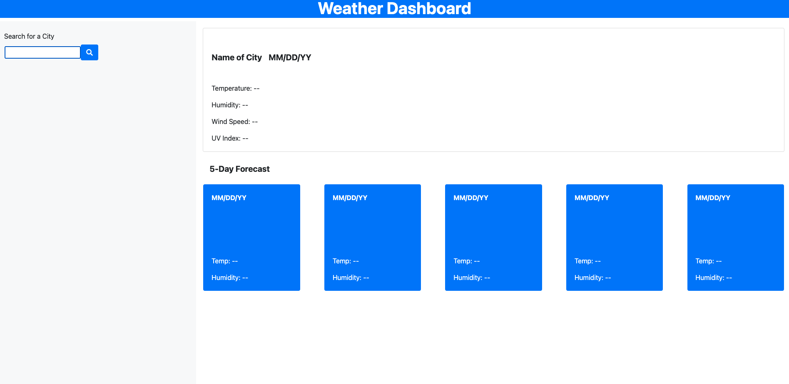
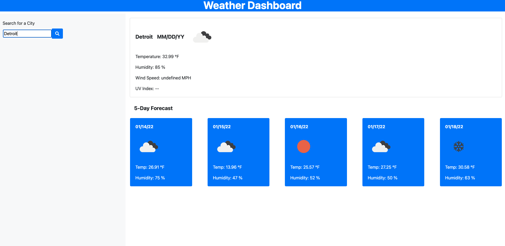

# Weather Dashboard

## Purpose

A tool that allows a user to input any city name and have the current weather as well as the next five day forecast populate on the screen.

## Table of Contents
- [Built With](#built-with)
- [Website](#website)
- [Installation](#installation)
- [Usage](#usage)
- [Contribution](#contribution)
- [License](#license)

## Built With

* HTML
* CSS
* JavaScript
* Font Awesome
* Bootstrap
* OpenWeatherMap

## Website

https://nsvoboda.github.io/nsvoboda-weather-dashboard/

### Installation

It is best practice to directly clone the respository by using the following code in your Terminal/Command Line:

git clone git@github.com:nsvoboda/nsvoboda-weather-dashboard.git

You can also download the files into a .zip directly from the GitHub repository.

### Usage

Enter the name of any city in order to see the weather forecast for today, as well as the next five days. Meant to help with planning your day, as well as any upcoming travel you have in the near term.

## Contribution
Edited with ❤️ by Nate.

## License

&copy; 2022 Nathaniel Svoboda

Licensed under the [BSD 2-Clause](LICENSE.txt)